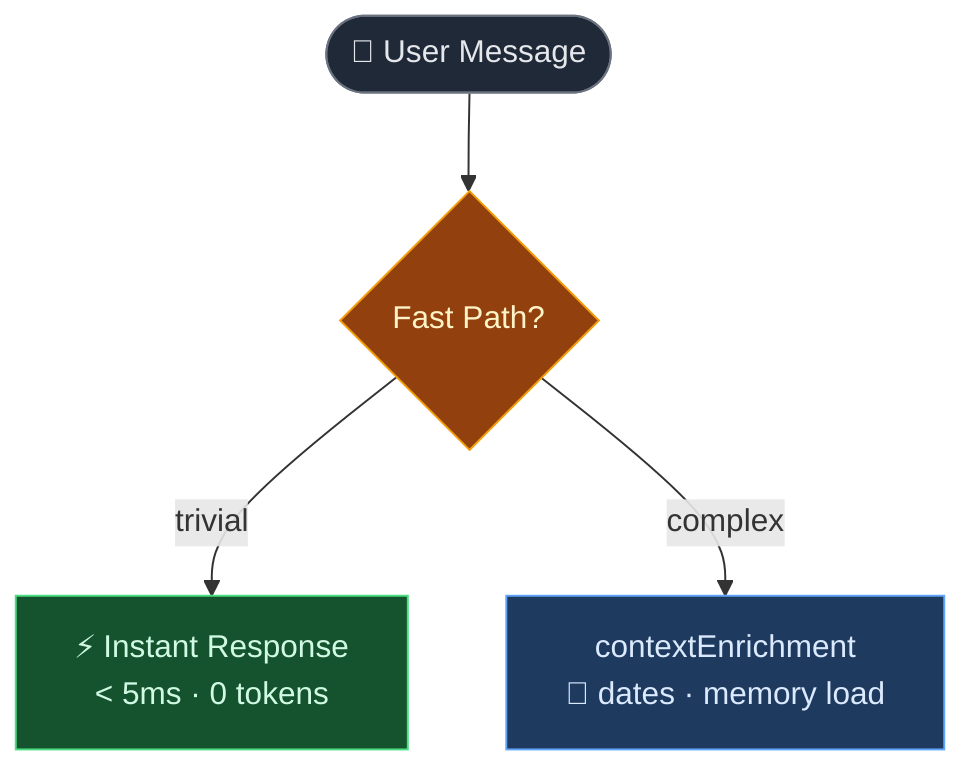
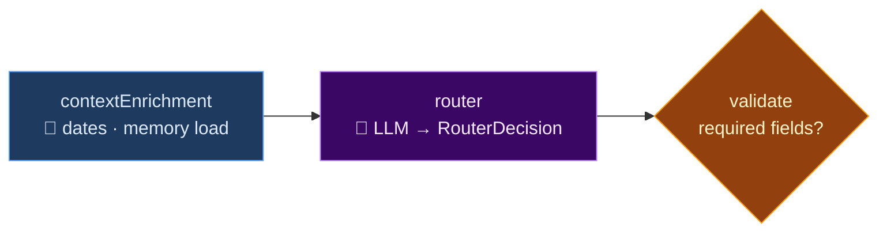
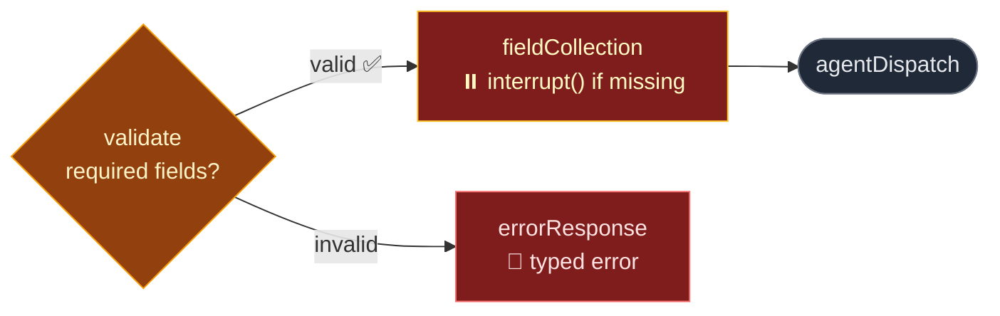
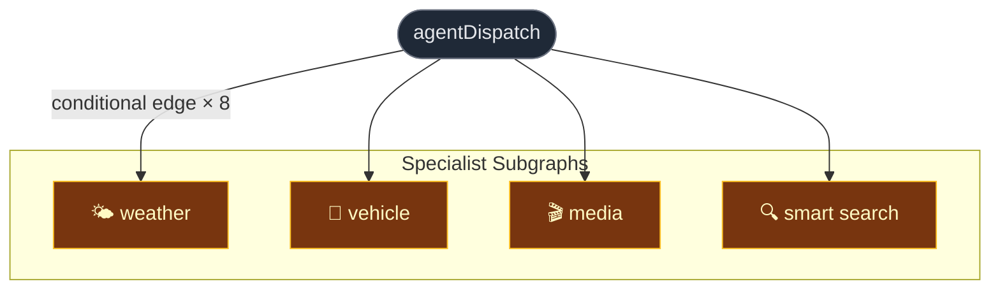
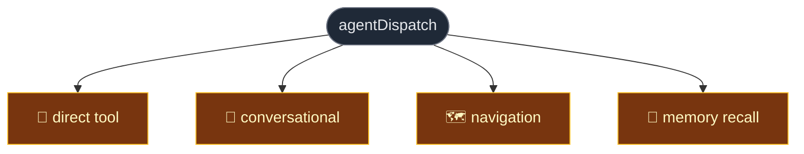
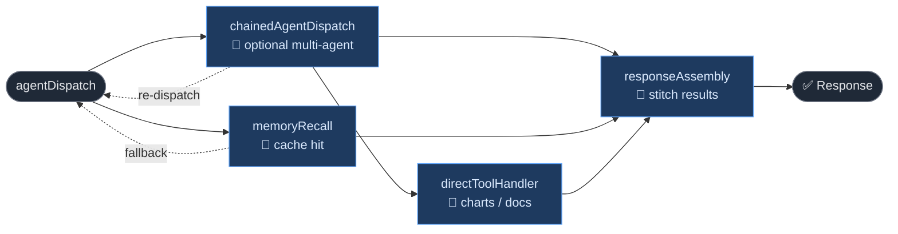
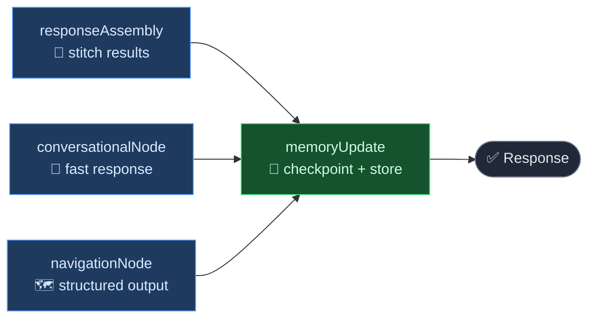

<!-- background: ../assets/img/evercam.jpg -->
<!-- fonts:
  sans: Inter, -apple-system, BlinkMacSystemFont, sans-serif
  # default
  weights: '200,400,600' -->

  

    Evercam Labs · April 2026
  

  <h1
    v-motion
    :initial="{ opacity: 0, scale: 0.92 }"
    :enter="{ opacity: 1, scale: 1, transition: { delay: 200, duration: 700 } }"
    class="text-6xl font-black leading-tight"
    style="background: #E72C32; -webkit-background-clip: text; -webkit-text-fill-color: transparent;"
  >
    Evercam Copilot v2
  </h1>

  

    From Prompt Spaghetti to a Production-Grade AI Assistant
  

  

    LangGraph·Azure GPT-4o-mini·TypeScript·Jest
  

---
transition: fade-out
layout: center
---

<h2 class="text-3xl font-bold text-center mb-8">What is Evercam Copilot?</h2>

  
"How many trucks came through Gate B last Tuesday?"

  
"Was there weather that delayed the pour on Friday?"

  
"Show me a timelapse of the last 3 months."

  
"Take me to smart search for the East site."

  

    🌤️
    Weather
  

  

    🚗
    Vehicles
  

  

    🎬
    Media
  

  

    🔍
    Smart Search
  

  

    🗺️
    Navigate — 30+ dashboard routes
  

---
layout: image-right
image: https://images.unsplash.com/photo-1581094651181-35942459ef62?w=900&q=80
transition: slide-up
---

# The First Build

### A system held together with tape

  🧠
  

    
Memory

    
Manual 6-message window. Follow-ups from 8 messages ago? Completely lost. Context from Project A bled into Project B.

  

  📅
  

    
Date Hallucinations

    
"Last Tuesday" → LLM guesses. Sometimes off by a week. A site manager quoted a wrong vehicle count in a client report.

  

  💸
  

    
High Tokens Every Request

    
Full conversation + project context + system prompt re-injected every message. "Hello" cost the same as a complex query.

  

  🔧
  

    
Routing in Prompt Strings

    
A typo in a JSON key silently routed everything to the wrong agent for days. No tests caught it. We had minimal test coverage.

  

---
layout: two-cols
layoutClass: gap-12
transition: slide-left
---

# The Old System

What happened on every message

  1
  Inject last 6 messages + full project context

  2
  LLM call — high token load

  3
  LLM guesses the route (no type safety)

  4
  Second LLM call — agent execution

  5
  Response — maybe hallucinated 🎲

::right::

| Metric | Before |
|---|---|
| Prompt tokens / message | **20,245–35,913** (avg, sessions A/B) |
| Completion tokens / message | **45–102** (avg, sessions A/B) |
| Total cost (4 msgs) | **$0.204–$0.363** |
| Unit tests | **Sparse** |

  
The root cause

  
Treating the LLM as a Swiss Army knife — routing, memory, date logic, and response generation all in one pass. Errors in any step compound.

  Source: Azure `gpt-4o` usage screenshots from Apr 1, 2026 and Apr 8, 2026 (4 messages each).

---
layout: center
transition: fade
---

  
💡

  <h2 class="text-4xl font-bold mb-8">The Key Insight</h2>

  

    Use the LLM to generate text. 
    Use TypeScript to make decisions.
  

  

    Routing rules in TypeScript. Date logic in pure functions. 
    Field validation with Zod schemas. The LLM generates the response — nothing else.
  

---
layout: two-cols
layoutClass: gap-10
transition: slide-up
---

# Why LangGraph?

Problems solved

| Problem | Solution |
|---|---|
| LLM date hallucinations | Deterministic pre-processing |
| High tokens / message | Checkpointed messages (lower prompt load) |
| Manual 6-msg window | `messagesStateReducer` (LangGraph) |
| No field collection | `interrupt()` → resume |
| Routing in prompts | Typed graph edges |
| Greetings cost full LLM | Fast-path: <5ms, 0 tokens |

::right::

Tech stack

| Layer | Technology |
|---|---|
| Graph runtime | LangGraph JS |
| LLM | Azure OpenAI `gpt-4o-mini` (default) |
| Structured output | `withStructuredOutput(Zod)` |
| Agent executor | LangChain ReAct |
| Checkpointing | MemorySaver / PostgresSaver |
| Tests | Jest |

  Philosophy: 
  Code-first, not prompt-driven. No silent fallbacks. Every error surfaces as a typed result.

---
layout: center
transition: slide-left
class: px-6 py-3
---

  <h1 class="text-xl font-bold">The New Architecture</h1>
  17 nodes · explicit state · deterministic flow

① Input · Fast Path

---
layout: center
transition: slide-left
class: px-6 py-3
---

  <h1 class="text-xl font-bold">The New Architecture — Validation → Dispatch</h1>
  
17 nodes · explicit state · deterministic flow

① Input · Routing · Validation

---
layout: center
transition: slide-left
class: px-6 py-3
---

  <h1 class="text-xl font-bold">The New Architecture — Agent Execution (Specialists)</h1>
  
17 nodes · explicit state · deterministic flow

① Validation Outcomes → Agent Dispatch

---
layout: center
transition: slide-left
class: px-6 py-3
---

  <h1 class="text-xl font-bold">The New Architecture — Agent Execution (System)</h1>
  
17 nodes · explicit state · deterministic flow

② Agent Execution — Specialist Subgraphs

---
layout: center
transition: slide-left
class: px-6 py-3
---

  <h1 class="text-xl font-bold">The New Architecture — Response</h1>
  
17 nodes · explicit state · deterministic flow

③ Agent Execution — System/Utility Agents

---
transition: slide-left
class: px-6 py-3
---

  <h1 class="text-xl font-bold">The New Architecture — Memory</h1>
  
17 nodes · explicit state · deterministic flow

④ Response

---
transition: slide-left
class: px-6 py-3
---

  <h1 class="text-xl font-bold">The New Architecture — Memory Update</h1>
  
17 nodes · explicit state · deterministic flow

④ Memory

---
layout: center
transition: fade-out
---

# 5 Key Innovations

  🕐
  

    Deterministic Temporal Resolver — 
    16 regex patterns resolve dates to UTC <em>before</em> any LLM call. "Last Tuesday 9am" → <code class="text-xs">2026-03-31T09:00:00Z</code>. Fewer date hallucinations.
  

  ⚡
  

    Fast-Path Router — 
    Greetings, datetime, capabilities intercepted before the graph initializes. Zero tokens. Under 5ms.
  

  🗂️
  

    Structured Routing — 
    Router returns a typed <code class="text-xs">RouterDecision</code> object, Zod-validated. Never free text. The graph cannot act on malformed output.
  

  ⏸️
  

    Interrupt-Based Field Collection — 
    Graph <em>pauses</em> on missing fields, asks the user, resumes from exact checkpoint. No polling, no timeouts, no silent failures.
  

  🧠
  

    Two-Tier Memory — 
    LangGraph checkpointing auto-manages conversation history. AgentMemoryStore holds 80-interaction episodic buffer + user preferences across sessions.
  

---
layout: center
transition: slide-up
---

# Two-Tier Memory

  
Tier 1 — LangGraph Checkpointing

  

    
▸<strong class="text-white/90">Full message history</strong> — stored automatically after every node execution

    
▸<strong class="text-white/90">Resume from any checkpoint</strong> — on interrupt or crash

    
▸<strong class="text-white/90">MemorySaver</strong> (dev) → <strong class="text-white/90">PostgresSaver</strong> (prod)

    
History cost reduced via checkpointed messages

  

  
Tier 2 — AgentMemoryStore

  

    
▸<strong class="text-white/90">Episodic Buffer</strong> — last 80 interactions, scored retrieval

    
▸<strong class="text-white/90">Working Memory</strong> — last project, camera, intent in session

    
▸<strong class="text-white/90">User Preferences</strong> — temp unit, default camera across sessions

    
"Show yesterday's weather" — Copilot knows <strong>which project</strong> you're on

  

  

    
$0.07

    
test suite cost (Apr 8)

  

  

    
3.5k–4.1k

    
avg input tokens / msg

  

  

    
2 / 45

    
edge-case failures

  

---
layout: center
transition: fade
---

<h2 class="text-4xl font-bold text-center mb-10">The Results</h2>

  

    
3.6k–4.1k

    
Avg tokens / message

  

  

    
Reduced

    
Date hallucinations

  

  

    
&lt;5ms

    
Trivial query latency

  

  

    
95%+

    
Test pass rate

  

  

    
Fewer

    
Large files

  

  

    
More

    
Focused modules

  

---
layout: center
transition: fade
---

<h2 class="text-3xl font-bold text-center mb-6">Old vs New (Overall)</h2>

  <table class="w-full text-left">
    <thead>
      <tr class="text-white/50">
        <th class="pr-3">Metric</th>
        <th class="pr-3">Old system (Azure gpt-4o)</th>
        <th>New system (tests 2026-04-08)</th>
      </tr>
    </thead>
    <tbody>
      <tr>
        <td class="pr-3">Prompt tokens / msg</td>
        <td class="pr-3">20,245–35,913</td>
        <td>4,265</td>
      </tr>
      <tr>
        <td class="pr-3">Completion tokens / msg</td>
        <td class="pr-3">45–102</td>
        <td>98</td>
      </tr>
      <tr>
        <td class="pr-3">Total tokens / msg</td>
        <td class="pr-3">20,290–36,015</td>
        <td>4,364</td>
      </tr>
      <tr>
        <td class="pr-3">Cost / msg</td>
        <td class="pr-3">$0.051–$0.091</td>
        <td>$0.00066</td>
      </tr>
      <tr>
        <td class="pr-3">Sample size</td>
        <td class="pr-3">8 msgs (Apr 1 & Apr 8, 2026)</td>
        <td>106 msgs (Prompt guide + Router edge + Project memory)</td>
      </tr>
    </tbody>
  </table>

---
layout: two-cols
layoutClass: gap-10
transition: slide-left
---

# Code Quality

Before — Monoliths

  

    agents/HierarchicalCopilotChat.ts
    1,557L
  

  

    agents/prompts.ts
    1,306L
  

  

    tools/smartSearch.ts
    432L
  

  

    tools/utils.ts
    384L
  

  

    agents/utils.ts
    172L
  

::right::

After — Focused modules

  

    temporalResolver.ts 58L 
    + temporalDateUtils.ts (100L) + temporalPatterns.ts (282L)
  

  

    toolFactory.ts 201L 
    + anprDataProcessor.ts (46L) + weatherDataProcessor.ts (67L)
  

  

    state.ts 272L 
    + schemas.ts (2L)
  

  

    router.ts 151L 
    + routerPrompts.ts (202L)
  

  

    smartSearch.ts 306L 
    + smartSearchTypes.ts (2L) + smartSearchGeometry.ts (70L)
  

  New modules extracted · APIs preserved · test pass rate ~95%

---
layout: center
transition: fade-out
---

# What Copilot Can Do Today

  

    🌤️
    Weather Agent
  

  

    getCurrentWeather
    getDailyWeather
    getHourlyWeather
  

  

    🚗
    Vehicle Agent
  

  

    getVehiclesCounts
    getVehiclesDetections
  

  

    🎬
    Media Agent
  

  

    createClip
    createTimelapse
  

  

    🔍
    Smart Search
  

  

    smartSearch
  

  

    

      🗺️
      Utility Tools
    

    

      navigateToPage (30+ routes)
      renderCharts
      fileSearch
      requestMissingFields
    

  

---
layout: image-right
image: https://images.unsplash.com/photo-1485827404703-89b55fcc595e?w=900&q=80
transition: slide-up
---

# What's Next

  
Short Term

  <ul class="text-sm text-white/75 space-y-1">
    <li>▸ PostgreSQL persistence for production</li>
    <li>▸ Document search + report generation</li>
    <li>▸ Streaming for all response paths</li>
  </ul>

  
Medium Term

  <ul class="text-sm text-white/75 space-y-1">
    <li>▸ Multi-project queries across all sites</li>
    <li>▸ Proactive notifications & anomaly alerts</li>
    <li>▸ Voice interface</li>
  </ul>

  
Long Term

  
Copilot as the <em>primary interface</em> — not just an assistant, but the way you work with Evercam. No dashboards to navigate.

---
layout: center
transition: fade
background: https://images.unsplash.com/photo-1558618666-fcd25c85cd64?w=1920&q=80
class: text-center
---

  

    A System We Can Trust
  

  

    Every step is code. Every step is testable. Every step is auditable. 
    The LLM generates the response — everything else is deterministic TypeScript.
  

  

    

      
Lower

      
Token cost

    

    

      
All

      
Tests passing

    

    

      
Reduced

      
Hallucinations

    

  

  

    LangGraph · LangChain · Azure OpenAI gpt-4o-mini · TypeScript
  

