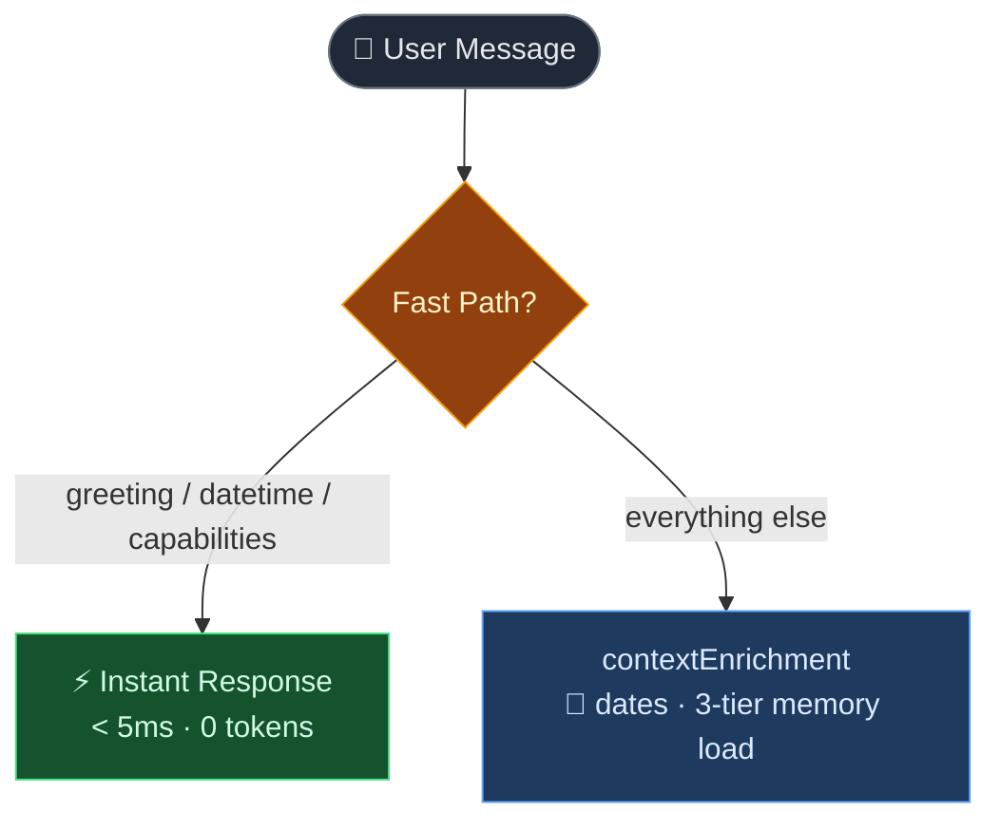
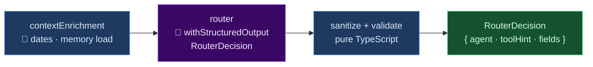
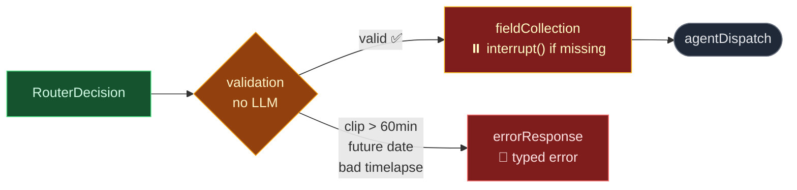
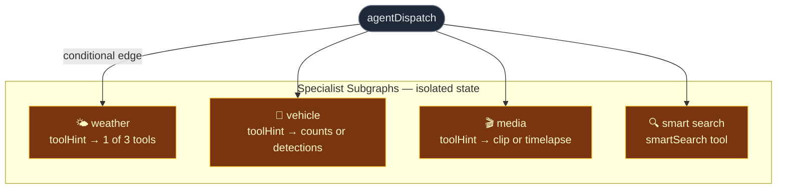
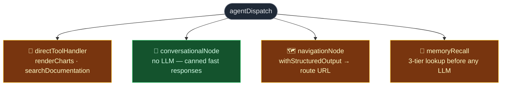
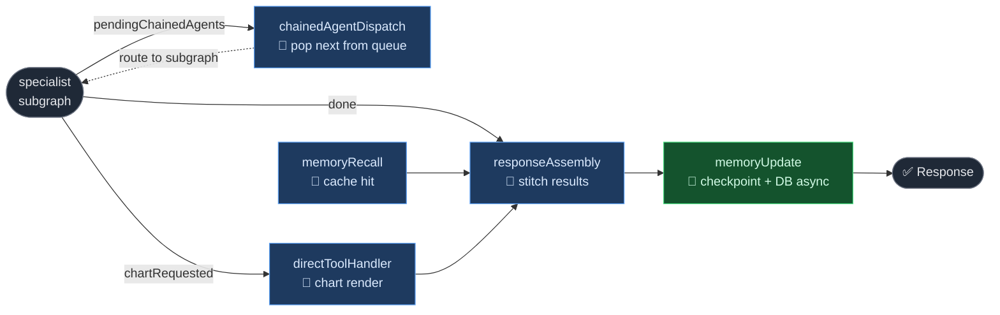

<!-- background: ../assets/img/evercam.jpg -->

  

    Evercam Labs · April 2026
  

  <h1
    v-motion
    :initial="{ opacity: 0, scale: 0.92 }"
    :enter="{ opacity: 1, scale: 1, transition: { delay: 200, duration: 700 } }"
    class="text-6xl font-black leading-tight"
    style="background: #E72C32; -webkit-background-clip: text; -webkit-text-fill-color: transparent;"
  >
    Evercam Copilot v2
  </h1>

  

    From Prompt Spaghetti to a Production-Grade AI Assistant
  

  

    LangGraph·Azure GPT-4o-mini·TypeScript·Jest
  

<!--
Welcome everyone. This talk is about a complete rewrite of Evercam's AI assistant — Copilot. Not just a refactor, but a ground-up rethink of how we build AI features that are reliable, testable, and don't cost a fortune to run. I'll walk you through what broke in v1, the insight that changed how we approached it, and the architecture we landed on. Let's get into it.
-->

---
transition: fade-out
layout: center
---

<h2 class="text-3xl font-bold text-center mb-8">What is Evercam Copilot?</h2>

  
"How many trucks came through Gate B last Tuesday?"

  
"Was there weather that delayed the pour on Friday?"

  
"Show me a timelapse of the last 3 months."

  
"Take me to smart search for the East site."

  

    🌤️
    Weather
  

  

    🚗
    Vehicles
  

  

    🎬
    Media
  

  

    🔍
    Smart Search
  

  

    🗺️
    Navigate — 30+ dashboard routes
  

<!--
Copilot is a natural language interface layered on top of Evercam's data. Site managers and engineers can ask questions in plain English instead of clicking through dashboards. These are real questions our users ask — "how many trucks", "was there weather", "show me a timelapse". The five domains on the right are what the assistant can handle today. Each one connects to real data — cameras, detections, weather APIs, media creation. It's not a chatbot that generates text. It actually does things.
-->

---
layout: image-right
image: https://images.unsplash.com/photo-1581094651181-35942459ef62?w=900&q=80
transition: slide-up
---

# The First Build

### A system held together with tape

  🧠
  

    
Leaking Memory

    
Manual 6-message window. Follow-ups from 8 messages ago? Completely lost. Context from Project A bled into Project B.

  

  📅
  

    
Date Hallucinations

    
"Last Tuesday" → LLM guesses. Sometimes off by a week. A site manager quoted a wrong vehicle count in a client report.

  

  💸
  

    
Every Message Was Expensive

    
Full conversation + project context + system prompt re-injected every message. "Hello" cost the same as a complex query.

  

  🔧
  

    
Routing in Prompt Strings

    
A typo in a JSON key silently routed everything to the wrong agent for days. No tests caught it. We had minimal coverage.

  

<!--
Let me tell you what we were dealing with before. The first version was built fast and it worked — until it didn't. The memory issue was real: we had a 6-message sliding window, and anything outside that window was gone. We had a case where a user's context from Project A leaked into Project B. The date hallucinations were the worst — we had a site manager take a vehicle count from Copilot and put it in a client report, and it was wrong because the LLM guessed the date range. The routing bug was also painful — a typo in a prompt string, and the wrong agent ran silently for days with no error, no test failure, nothing. These weren't edge cases. These were regular patterns.
-->

---
layout: two-cols
layoutClass: gap-12
transition: slide-left
---

# The Old System

What happened on every message

  1
  Inject last 6 messages + full project context

  2
  LLM call — 20k–36k tokens per message

  3
  LLM guesses the route (no type safety)

  4
  Second LLM call — agent execution

  5
  Response — maybe hallucinated 🎲

::right::

| Metric | Before |
|---|---|
| Prompt tokens / message | **20,245–35,913** |
| Completion tokens / message | **45–102** |
| Total cost (4 msgs) | **$0.20–$0.36** |
| Unit tests | **Sparse** |

  
The root cause

  
Treating the LLM as a Swiss Army knife — routing, memory, date logic, and response generation all in one pass. Errors in any step compound.

  Source: Azure <code>gpt-4o</code> usage logs, Apr 1 & Apr 8, 2026 (4 messages each session).

<!--
Here are the actual numbers. Up to 36,000 tokens per message. That's the entire project context, all messages, all tool definitions, re-injected every single time. Say "hello" — 20k tokens burned. The core problem is architectural: we were asking the LLM to do everything in one pass. Route the intent, resolve the dates, pick the right fields, run the tool, write the response. Any failure in that chain cascades. And because it was all in one prompt, there was nothing to test independently. That's what we set out to fix.
-->

---
layout: center
transition: fade
---

  
💡

  <h2 class="text-4xl font-bold mb-8">The Key Insight</h2>

  

    Use the LLM to generate text. 
    Use TypeScript to make decisions.
  

  

    Routing rules in TypeScript. Date logic in pure functions. 
    Field validation with Zod schemas. The LLM generates the response — nothing else.
  

  

    

      
Before

      
LLM decides route, dates, fields, and writes the answer

    

    

      
After — TypeScript

      
Routing, dates, validation, field collection

    

    

      
After — LLM

      
Intent classification + response generation only

    

  

<!--
This is the single idea that changed everything. Stop asking the LLM to be a decision engine — it's a text generator. Dates are math: pure functions, no LLM needed. Routing is a switch statement: TypeScript, not a prompt. Field validation is a Zod schema. The LLM should only do what it's good at — understanding intent and writing a natural-language response. The moment we drew this line clearly, the whole architecture became obvious.
-->

---
layout: two-cols
layoutClass: gap-10
transition: slide-up
---

# Why LangGraph?

Problems solved

| Problem | Solution |
|---|---|
| LLM date hallucinations | Deterministic pre-processing |
| High tokens / message | Checkpointed messages |
| Manual 6-msg window | `messagesStateReducer` |
| No field collection | `interrupt()` → resume |
| Routing in prompts | Typed graph edges |
| "Hello" costs full LLM | Fast-path: <5ms, 0 tokens |
| Untestable monolith | 17 isolated, testable nodes |

::right::

Tech stack

| Layer | Technology |
|---|---|
| Graph runtime | LangGraph JS |
| LLM | Azure OpenAI `gpt-4o-mini` |
| Structured output | `withStructuredOutput(Zod)` |
| Agent executor | LangChain ReAct |
| Checkpointing | `MemorySaver` |
| Tests | Jest (45+ cases) |

  Philosophy: 
  Code-first, not prompt-driven. No silent fallbacks. Every error surfaces as a typed result.

  Key choice: 
  Graph recompiles per message (fresh SSE callbacks) but shares a single <code>MemorySaver</code> — state persists, connections don't.

<!--
LangGraph gave us a first-class primitive for every problem we had. State checkpointing replaced the manual message window. The interrupt/resume mechanism gave us field collection without any polling or timeout logic. Typed graph edges meant routing failures throw immediately rather than silently degrading. And splitting into 17 nodes meant each one could be unit tested in isolation. The key architectural note on the right: we rebuild the graph on every message so SSE streaming callbacks are always fresh, but the MemorySaver is shared — so conversation state persists across rebuilds. That's a subtle but important design.
-->

---
layout: center
transition: slide-left
class: px-6 py-3
---

  <h1 class="text-xl font-bold">The New Architecture</h1>
  17 nodes · explicit state · deterministic flow

① Message Entry — Fast Path Check

<!--
Now let's walk through the architecture step by step. The very first thing that happens on every message — before the graph even initializes — is a fast-path check. Three regexes: greetings, capability questions, and "what time is it" style queries. If any match, we return an instant response in under 5 milliseconds with zero tokens burned. "Hello" should not cost money. After that, the first real node is contextEnrichment — no LLM, just setup. It resolves dates from the user's message, loads the three-tier memory, and snapshots state for the turn.
-->

---
layout: center
transition: slide-left
class: px-6 py-3
---

  <h1 class="text-xl font-bold">The New Architecture — Router</h1>
  
17 nodes · explicit state · deterministic flow

② Router — The Only LLM Decision Point

<!--
The router is the only LLM call that makes a decision. And critically — it can't return free text. We use LangChain's withStructuredOutput with a Zod schema, so the LLM is forced to return a typed RouterDecision object. Agent type, tool hint, confidence, resolved fields, whether a chart was requested, whether there are multiple agents to chain. If the LLM tries to return anything malformed, LangChain throws immediately. After the LLM returns, pure TypeScript functions sanitize the output — validate project names exist, check exids with a regex, inject the working-memory project if the LLM missed it. The LLM's job here is classification only.
-->

---
layout: center
transition: slide-left
class: px-6 py-3
---

  <h1 class="text-xl font-bold">The New Architecture — Validation & Dispatch</h1>
  
17 nodes · explicit state · deterministic flow

③ Constraint Checking → Field Collection → Dispatch

<!--
After the router, we have two deterministic gates — no LLM in either. First is validation: checks hard constraints like clip duration over 60 minutes, future dates for media, invalid timelapse lengths. These are rules, not judgements — TypeScript, not a prompt. If validation fails, we go straight to an error response with a human-readable message. If it passes, fieldCollection checks whether we have everything we need — project, camera, date range. If anything's missing, the graph pauses using LangGraph's interrupt mechanism, asks the user, and resumes from the exact same checkpoint. No polling, no timeouts. Then agentDispatch routes to the right specialist.
-->

---
layout: center
transition: slide-left
class: px-6 py-3
---

  <h1 class="text-xl font-bold">The New Architecture — Specialist Subgraphs</h1>
  
17 nodes · explicit state · deterministic flow

④ Specialist Subgraphs — One Tool Each

<!--
Each specialist subgraph is its own isolated StateGraph with its own state type. The key design rule: each subgraph agent receives exactly one tool. Not a list of tools — one. This eliminates tool confusion entirely. The router already decided which tool via toolHint: for weather, is it hourly, current, or daily? For vehicle, counts or detections? For media, clip or timelapse? The subgraph just executes that one tool. The agent prompt is also much smaller because it doesn't need to explain tool selection logic — that's been moved upstream into TypeScript.
-->

---
layout: center
transition: slide-left
class: px-6 py-3
---

  <h1 class="text-xl font-bold">The New Architecture — Utility Agents</h1>
  
17 nodes · explicit state · deterministic flow

⑤ Non-Data Paths — Utility Agents

<!--
Not everything goes through a data subgraph. Conversational node handles greetings and out-of-scope messages — no LLM, just canned responses from the fast-path router. Navigation uses structured output to return a typed route URL. Memory recall has a three-tier lookup: first tries to answer from in-state data like toolResults or workingMemory, then hits the episodic store, and only spins up a fallback agent as a last resort. DirectToolHandler is where charts and documentation search land.
-->

---
transition: slide-left
class: px-6 py-3
---

  <h1 class="text-xl font-bold">The New Architecture — Response & Memory</h1>
  
17 nodes · explicit state · deterministic flow

⑥ Multi-Agent Chaining → Assembly → Memory Write

<!--
After a specialist finishes, we check three things in priority order: are there more agents in the queue? Is a chart requested? Or are we done? ChainedAgentDispatch pops the next agent from the queue and routes to that subgraph — it does NOT go back through agentDispatch. ResponseAssembly uses a turnResultOffset to slice only the current turn's results out of the accumulated toolResults array, since multi-turn conversations accumulate results indefinitely. MemoryUpdate writes messages to the checkpoint, episodic entries to the in-memory store, and fires an async Prisma write to the DB without blocking the response.
-->

---
layout: center
transition: slide-up
class: px-6 py-3
---

<h2 class="text-2xl font-bold text-center mb-5">Real Query Walkthrough</h2>

"Show me vehicles on Gate B last Tuesday — and clip the last detection"

<!--
Let me make this concrete with a real query. "Show me vehicles on Gate B last Tuesday and clip the last detection." Here's what actually happens: contextEnrichment resolves "last Tuesday" to exact ISO dates before any LLM sees it. The router returns a structured decision: vehicle agent, with media queued as a chained agent, toolHint set to detections. FieldCollection is smart here — it skips asking for cameraExid for the media agent, because it knows the vehicle detection result will contain it. The vehicle subgraph runs, returns a detection array. ChainedAgentDispatch finds the latest detection, takes its timestamp, builds a ±5 minute clip window, and injects the cameraExid directly — the user never gets asked for it. The media subgraph runs with those pre-filled fields. ResponseAssembly stitches both results together. This is a two-agent chain that feels seamless to the user.
-->

---
layout: center
transition: fade-out
---

# 5 Key Innovations

  🕐
  

    Deterministic Temporal Resolver — 
    16 regex patterns resolve dates to UTC <em>before</em> any LLM call. "Last Tuesday 9am" → <code class="text-xs">2026-03-31T09:00:00Z</code>. Zero date hallucinations from this layer.
  

  ⚡
  

    Fast-Path Router — 
    Greetings, datetime, capabilities intercepted before the graph initializes. Zero tokens. Under 5ms. Two layers: before graph build and inside the router node.
  

  🗂️
  

    Structured Routing — 
    Router returns a typed <code class="text-xs">RouterDecision</code> object, Zod-validated. Never free text. Malformed output throws immediately — no silent degradation.
  

  ⏸️
  

    Interrupt-Based Field Collection — 
    Graph <em>pauses</em> on missing fields, asks the user, resumes from exact checkpoint. No polling, no timeouts, no silent failures.
  

  🧠
  

    Three-Tier Memory — 
    LangGraph checkpoint for conversation history · in-memory episodic store (80 entries, scored retrieval) · Prisma DB for cross-session persistence.
  

<!--
Five things I'm most proud of. The temporal resolver took a lot of regex work but it was worth it — no date hallucinations from this layer, ever. The fast-path has two layers because the graph can also receive a Command resume after an interrupt, so the router node checks again internally. Structured routing sounds simple but it's a huge reliability win — the router cannot return garbage. Interrupt-based field collection is the most elegant piece — the graph literally pauses mid-execution, waits for user input, and resumes from the exact byte it stopped at. And the three-tier memory is what gives Copilot its "it knows me" quality.
-->

---
layout: center
transition: slide-up
---

# Three-Tier Memory

  
Tier 1 — LangGraph Checkpoint

  

    
▸<strong class="text-white/90">Full message history</strong> — stored after every node

    
▸<strong class="text-white/90">workingMemory</strong> — current project, camera, last intent

    
▸<strong class="text-white/90">Resume from any checkpoint</strong> on interrupt or crash

    
Scope: conversation

  

  
Tier 2 — AgentMemoryStore

  

    
▸<strong class="text-white/90">Episodic buffer</strong> — 80 interactions, BM25-scored retrieval

    
▸<strong class="text-white/90">User preferences</strong> — temp unit, default camera

    
▸<strong class="text-white/90">Smart search nav queue</strong>

    
Scope: session (in-memory)

  

  
Tier 3 — PersistentMemoryStore

  

    
▸<strong class="text-white/90">Prisma DB</strong> — <code class="text-xs">copilot_memories</code> table

    
▸<strong class="text-white/90">Hydrates on first message</strong> — loads last 20 per conversation

    
▸<strong class="text-white/90">firstUserMessage</strong> — permanent, survives restarts

    
Scope: cross-session (DB)

  

  

    
$0.07

    
full test suite cost (Apr 8)

  

  

    
3.5k–4.1k

    
avg input tokens / message

  

  

    
~95%

    
test pass rate (43/45)

  

<!--
The three-tier memory is what makes Copilot feel intelligent across time. Tier 1 is LangGraph's built-in checkpointing — it stores messages and working memory automatically after every node execution. This is what replaced our manual 6-message window. Tier 2 is an in-memory episodic buffer — up to 80 interactions, retrieved by BM25-style scoring with project and camera boosts. If you ask "which camera was that on?" it checks this store before doing anything else. Tier 3 is what makes memory survive server restarts — a Prisma table, hydrated at conversation start, written async so it never blocks a response. These numbers at the bottom are real — the entire test suite, including all 45 cases, cost 7 cents on April 8th.
-->

---
layout: center
transition: fade
---

<h2 class="text-4xl font-bold text-center mb-10">The Results</h2>

  

    
3.6k–4.1k

    
Avg tokens / message

    
was 20k–36k

  

  

    
Eliminated

    
Date hallucinations

    
from temporal layer

  

  

    
&lt;5ms

    
Trivial query latency

    
greetings / datetime

  

  

    
~95%

    
Test pass rate

    
43 / 45 cases

  

  

    
17

    
Isolated nodes

    
each independently testable

  

  

    
$0.00066

    
Cost per message

    
was $0.05–$0.09

  

<!--
The results are significant. Token count dropped from up to 36k to between 3.6k and 4.1k per message — roughly a 90% reduction. The temporal resolver eliminated date hallucinations from that layer entirely. Greetings are under 5ms. The test suite has 45 cases covering router edge cases, fast path, temporal resolution, validation, and conversation flow. 43 pass cleanly; 2 edge cases are known and logged. The cost number is striking — $0.00066 per message using gpt-4o-mini, versus $0.05–$0.09 with gpt-4o in the old system. That's roughly a 100x cost reduction per message.
-->

---
layout: center
transition: fade
---

<h2 class="text-3xl font-bold text-center mb-6">Old vs New — Overall</h2>

  <table class="w-full text-left">
    <thead>
      <tr class="text-white/50 border-b border-white/10">
        <th class="pr-3 pb-2">Metric</th>
        <th class="pr-3 pb-2">Old system (Azure gpt-4o)</th>
        <th class="pb-2">New system (gpt-4o-mini, Apr 8)</th>
      </tr>
    </thead>
    <tbody class="space-y-1">
      <tr class="border-b border-white/5">
        <td class="pr-3 py-2">Prompt tokens / msg</td>
        <td class="pr-3 py-2 text-red-400">20,245–35,913</td>
        <td class="py-2 text-green-400">3,600–4,100</td>
      </tr>
      <tr class="border-b border-white/5">
        <td class="pr-3 py-2">Completion tokens / msg</td>
        <td class="pr-3 py-2 text-red-400">45–102</td>
        <td class="py-2 text-green-400">98 (avg)</td>
      </tr>
      <tr class="border-b border-white/5">
        <td class="pr-3 py-2">Cost / message</td>
        <td class="pr-3 py-2 text-red-400">$0.051–$0.091</td>
        <td class="py-2 text-green-400">$0.00066</td>
      </tr>
      <tr class="border-b border-white/5">
        <td class="pr-3 py-2">Date hallucinations</td>
        <td class="pr-3 py-2 text-red-400">Occasional, silent</td>
        <td class="py-2 text-green-400">Eliminated (temporal layer)</td>
      </tr>
      <tr class="border-b border-white/5">
        <td class="pr-3 py-2">Routing failures</td>
        <td class="pr-3 py-2 text-red-400">Silent (wrong agent ran)</td>
        <td class="py-2 text-green-400">Throws immediately (Zod)</td>
      </tr>
      <tr>
        <td class="pr-3 py-2">Test coverage</td>
        <td class="pr-3 py-2 text-red-400">Sparse</td>
        <td class="py-2 text-green-400">45 cases · ~95% passing</td>
      </tr>
    </tbody>
  </table>

  Source: Azure OpenAI usage logs Apr 1 & Apr 8, 2026 (old) · Jest test suite Apr 8, 2026 (new)

<!--
Here's the full comparison side by side. The numbers speak for themselves. Cost per message is 100x lower. Token count is down 90%. But the most important row is routing failures — in the old system, the wrong agent could run silently with no error surfaced. In the new system, a malformed router output throws immediately and the user gets a clean error message. That's the reliability story. The test coverage row is also important — going from sparse tests to 45 deterministic cases means we can confidently refactor without fear of regressions.
-->

---
layout: two-cols
layoutClass: gap-10
transition: slide-left
---

# Code Quality

Before — Monoliths

  

    HierarchicalCopilotChat.ts
    1,557L
  

  

    agents/prompts.ts
    1,306L
  

  

    tools/smartSearch.ts
    432L
  

  

    tools/utils.ts
    384L
  

  

    agents/utils.ts
    172L
  

::right::

After — Focused modules

  

    temporalResolver.ts 58L 
    + temporalDateUtils.ts (100L) + temporalPatterns.ts (282L)
  

  

    toolFactory.ts 201L 
    + anprDataProcessor.ts (46L) + weatherDataProcessor.ts (67L)
  

  

    state.ts 272L 
    + schemas.ts (re-export only)
  

  

    router.ts 151L 
    + routerPrompts.ts (202L) + routerValidation.ts + fastPathRouter.ts
  

  

    smartSearch.ts 306L 
    + smartSearchGeometry.ts (70L) + smartSearchQuery.ts
  

  Every file has a single responsibility · Tests map 1:1 to modules

<!--
The code quality story mirrors the architecture story. The old codebase had files pushing 1,500 lines. When everything lives in one file, you can't test it, you can't reason about it, and you can't safely change it. The new structure splits everything by responsibility — date math in one file, date patterns in another, the router's prompts separate from its logic. The important thing isn't that the files are smaller, it's that each file has one reason to change. The temporal resolver is pure functions — you can test every date pattern in isolation without mocking anything. The router validation is three pure functions. That's what made 45 test cases possible.
-->

---
layout: center
transition: fade-out
---

# What Copilot Can Do Today

  

    🌤️
    Weather Agent
  

  

    getCurrentWeather
    getDailyWeather
    getHourlyWeather
  

  

    🚗
    Vehicle Agent
  

  

    getVehiclesCounts
    getVehiclesDetections
  

  

    🎬
    Media Agent
  

  

    createClip
    createTimelapse
  

  

    🔍
    Smart Search
  

  

    smartSearch
    navigateToPage (30+ routes)
  

  

    

      🧰
      Utility Tools
    

    

      renderCharts
      searchDocumentation
      interrupt() field collection
    

  

<!--
This is the current capability surface. Each box maps to a specialist subgraph. Weather handles current conditions, multi-day reports, and hour-by-hour breakdowns — the router picks the right one based on the query. Vehicle has two modes: counts for aggregate queries, detections for plate-level events. Media creates clips and timelapses. Smart search can run a detection query and then navigate the user to the results page automatically. The utility row is important — charts can be layered on top of any data agent, documentation search is live, and field collection uses the interrupt mechanism rather than a dedicated tool.
-->

---
layout: image-right
image: https://images.unsplash.com/photo-1485827404703-89b55fcc595e?w=900&q=80
transition: slide-up
---

# What's Next

  
Short Term

  <ul class="text-sm text-white/75 space-y-1">
    <li>▸ Full streaming for all response paths (nav, conversational)</li>
    <li>▸ Richer multi-agent chains (3+ agents, parallel dispatch)</li>
    <li>▸ User preference learning — remember temp units, default cameras</li>
  </ul>

  
Medium Term

  <ul class="text-sm text-white/75 space-y-1">
    <li>▸ Multi-project queries across all sites simultaneously</li>
    <li>▸ Proactive notifications and anomaly alerts</li>
    <li>▸ Report generation — export data summaries to PDF</li>
  </ul>

  
Long Term

  
Copilot as the <em>primary interface</em> — not just an assistant, but the way you work with Evercam. No dashboards to navigate. Voice interface. Proactive, not reactive.

<!--
Where do we go from here? Short term: there are two response paths that don't stream token-by-token yet — navigation and conversational. That's a quick win. Multi-agent chains currently support two agents in sequence; we want to generalize to arbitrary chains and potentially parallel dispatch. Medium term is about breadth — multi-project queries are the most-requested feature from site managers with multiple sites. Proactive alerts would flip the model from reactive to push. Long term — the vision is that Copilot becomes the primary way you interact with Evercam. Not a sidebar feature, but the interface itself. Voice input, proactive summaries, no dashboards required.
-->

---
layout: center
transition: fade
background: https://images.unsplash.com/photo-1558618666-fcd25c85cd64?w=1920&q=80
class: text-center
---

  

    A System We Can Trust
  

  

    Every step is code. Every step is testable. Every step is auditable. 
    The LLM generates the response — everything else is deterministic TypeScript.
  

  

    

      
~90%

      
Token reduction

    

    

      
~95%

      
Test pass rate

    

    

      
Zero

      
Silent routing failures

    

  

  

    LangGraph · LangChain · Azure OpenAI gpt-4o-mini · TypeScript
  

<!--
I'll leave you with this. The goal of v2 wasn't to build a smarter AI — it was to build a more trustworthy system. The LLM is still doing the hard part: understanding language and generating responses. But everything around it — routing, dates, validation, field collection, memory — is deterministic TypeScript that you can read, test, and reason about. A typo in a prompt no longer silently routes the wrong agent for days. A missing field no longer causes a crash. A date like "last Tuesday" no longer produces a hallucination. That's what "a system we can trust" means. Thank you — happy to take questions.
-->
