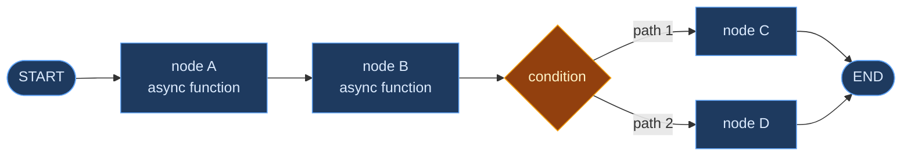
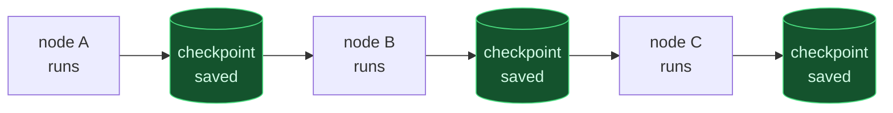
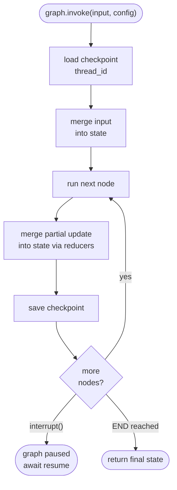

<div class="absolute inset-0 bg-black/65" />

<div class="relative z-10 flex flex-col items-center justify-center h-full gap-4">
  <div
    v-motion
    :initial="{ opacity: 0, y: -30 }"
    :enter="{ opacity: 1, y: 0, transition: { duration: 700 } }"
    class="text-xs tracking-widest uppercase text-blue-400 font-semibold"
  >
    Evercam Labs · April 2026
  </div>

  <h1
    v-motion
    :initial="{ opacity: 0, scale: 0.92 }"
    :enter="{ opacity: 1, scale: 1, transition: { delay: 200, duration: 700 } }"
    class="text-6xl font-black leading-tight"
    style="background: linear-gradient(135deg, #60a5fa, #a78bfa); -webkit-background-clip: text; -webkit-text-fill-color: transparent;"
  >
    LangGraph
  </h1>

  <p
    v-motion
    :initial="{ opacity: 0, y: 20 }"
    :enter="{ opacity: 1, y: 0, transition: { delay: 450, duration: 600 } }"
    class="text-xl text-white/65"
  >
    From Zero to Production — How It Works and Why It Matters
  </p>

  <div
    v-motion
    :initial="{ opacity: 0 }"
    :enter="{ opacity: 1, transition: { delay: 850, duration: 600 } }"
    class="flex gap-5 text-sm text-white/40 mt-4"
  >
    <span>StateGraph</span><span>·</span><span>Checkpointing</span><span>·</span><span>interrupt()</span><span>·</span><span>TypeScript</span>
  </div>
</div>

<!--
This talk is a ground-up explanation of LangGraph — what it is, how it works, and why we chose it. No prior AI framework knowledge assumed. By the end you'll understand the core mental model well enough to build with it and explain it to others.
-->

---
layout: center
transition: fade
---

<h2 class="text-3xl font-bold text-center mb-8">The Problem LangGraph Solves</h2>

<div class="grid grid-cols-2 gap-8 max-w-4xl mx-auto mt-4">

<div class="space-y-4">
  <div class="text-xs text-white/40 uppercase tracking-wider mb-3">Without LangGraph</div>
  <div v-click class="p-3 rounded-lg bg-red-900/30 border border-red-500/20 text-sm text-white/75">
    🎲 LLM decides what to do next — <span class="text-red-300">no control</span>
  </div>
  <div v-click class="p-3 rounded-lg bg-red-900/30 border border-red-500/20 text-sm text-white/75">
    📦 State managed manually — <span class="text-red-300">context bleeds</span>
  </div>
  <div v-click class="p-3 rounded-lg bg-red-900/30 border border-red-500/20 text-sm text-white/75">
    🔄 Missing input = restart from scratch
  </div>
  <div v-click class="p-3 rounded-lg bg-red-900/30 border border-red-500/20 text-sm text-white/75">
    🧪 Untestable — everything in one LLM call
  </div>
</div>

<div class="space-y-4">
  <div class="text-xs text-white/40 uppercase tracking-wider mb-3">With LangGraph</div>
  <div v-click class="p-3 rounded-lg bg-green-900/30 border border-green-500/20 text-sm text-white/75">
    ✅ TypeScript graph edges control the flow
  </div>
  <div v-click class="p-3 rounded-lg bg-green-900/30 border border-green-500/20 text-sm text-white/75">
    ✅ Typed shared state with reducers
  </div>
  <div v-click class="p-3 rounded-lg bg-green-900/30 border border-green-500/20 text-sm text-white/75">
    ✅ <code>interrupt()</code> → pause → resume from checkpoint
  </div>
  <div v-click class="p-3 rounded-lg bg-green-900/30 border border-green-500/20 text-sm text-white/75">
    ✅ Each node is an isolated, testable function
  </div>
</div>

</div>

<!--
Before explaining how LangGraph works, let's understand why it exists. When you build AI workflows with plain LangChain agents, the LLM is in charge of everything — it decides what tool to call, when to stop, what to do next. That works for open-ended tasks but falls apart in a product where you need predictable, auditable behaviour. LangGraph puts the developer back in control.
-->

---
layout: center
transition: slide-left
---

# The Core Mental Model

<div class="mt-8 max-w-3xl mx-auto">



<div class="grid grid-cols-3 gap-4 mt-8 text-center text-sm">
  <div v-click class="p-4 rounded-xl bg-blue-900/30 border border-blue-500/30">
    <div class="text-blue-300 font-bold mb-2">Nodes</div>
    <div class="text-white/60 text-xs">Async functions that read state and return partial updates</div>
  </div>
  <div v-click class="p-4 rounded-xl bg-orange-900/30 border border-orange-500/30">
    <div class="text-orange-300 font-bold mb-2">Edges</div>
    <div class="text-white/60 text-xs">Connections between nodes — static or conditional</div>
  </div>
  <div v-click class="p-4 rounded-xl bg-purple-900/30 border border-purple-500/30">
    <div class="text-purple-300 font-bold mb-2">State</div>
    <div class="text-white/60 text-xs">Typed shared object — every node reads and writes to it</div>
  </div>
</div>

</div>

<!--
Three concepts. That's the whole model. Nodes are functions. Edges are routing rules. State is the shared object. Everything else in LangGraph is built on top of these three things. If you understand these, you understand LangGraph.
-->

---
layout: center
transition: slide-left
class: px-8
---

# Nodes

<div class="mt-6 max-w-3xl mx-auto space-y-6">

<div v-click>
<div class="text-xs text-white/40 uppercase tracking-wider mb-2">A node is just an async function</div>

```ts
async function router(state: CopilotState) {
  const decision = await llm.invoke(buildPrompt(state))
  return { routingDecision: decision }   // partial state update
}
```
</div>

<div v-click>
<div class="text-xs text-white/40 uppercase tracking-wider mb-2">Or pure TypeScript — no LLM needed</div>

```ts
async function validation(state: CopilotState) {
  if (state.routingDecision.clipDuration > 60) {
    return { validationResult: { valid: false, error: "Clip too long" } }
  }
  return { validationResult: { valid: true } }
}
```
</div>

<div v-click class="p-4 rounded-xl bg-blue-500/10 border border-blue-500/30 text-sm">
  <span class="text-blue-300 font-semibold">Key rule: </span>
  <span class="text-white/70">A node only returns what it changed. LangGraph merges the partial update into the full state using reducers.</span>
</div>

</div>

<!--
A node is just an async function. It receives the full state, does its work — call an LLM, run some TypeScript logic, hit an API — and returns only the fields it changed. LangGraph handles merging that partial update back into the shared state. The node doesn't need to know anything about the rest of the graph.
-->

---
layout: center
transition: slide-left
class: px-8
---

# Edges

<div class="mt-6 max-w-3xl mx-auto space-y-6">

<div v-click>
<div class="text-xs text-white/40 uppercase tracking-wider mb-2">Static edge — always goes A to B</div>

```ts
graph.addEdge("contextEnrichment", "router")
graph.addEdge("router", "validation")
```
</div>

<div v-click>
<div class="text-xs text-white/40 uppercase tracking-wider mb-2">Conditional edge — TypeScript decides at runtime</div>

```ts
graph.addConditionalEdges("validation", (state) => {
  return state.validationResult.valid
    ? "fieldCollection"
    : "errorResponse"
})
```
</div>

<div v-click>
<div class="text-xs text-white/40 uppercase tracking-wider mb-2">Fan-out — one node routes to many</div>

```ts
graph.addConditionalEdges("agentDispatch", (state) => {
  switch (state.routingDecision.selectedAgent) {
    case "weather":  return "weatherSubgraph"
    case "vehicle":  return "vehicleSubgraph"
    case "media":    return "mediaSubgraph"
    default:         return "conversationalNode"
  }
})
```
</div>

</div>

<!--
Edges are just routing rules. Static edges always go from A to B. Conditional edges are TypeScript functions that read the state and return the name of the next node to run. This is the key shift from LangChain: the routing logic is in your code, not in a prompt. A typo in a switch statement throws a TypeScript error. A typo in a prompt runs silently.
-->

---
layout: center
transition: slide-left
class: px-8
---

# State & Reducers

<div class="mt-4 max-w-3xl mx-auto space-y-4">

<div v-click>
<div class="text-xs text-white/40 uppercase tracking-wider mb-2">Define state with Annotation.Root</div>

```ts
const CopilotState = Annotation.Root({
  userInput:       Annotation<string>(),
  routingDecision: Annotation<RouterDecision>(),
  toolResults:     Annotation<ToolResult[]>({
    reducer: (existing, newItems) => [...existing, ...newItems],  // append
    default: () => [],
  }),
  messages: Annotation<BaseMessage[]>({
    reducer: messagesStateReducer,  // dedup by id
  }),
})
```
</div>

<div v-click class="text-xs">

| Reducer | Behaviour | Use when |
|---|---|---|
| last-write-wins (default) | new value replaces old | most fields |
| append | adds to array | accumulating results |
| shallow merge | merges objects | partial field updates |
| dedup by id | safe concurrent writes | message history |

</div>

</div>

<!--
State is the contract between all nodes. You define it once with Annotation.Root and every node in the graph works with the same typed object. Reducers are how you control what happens when two nodes write to the same field — which matters when nodes run after each other and you want to accumulate results rather than overwrite them. The toolResults field uses an append reducer — each specialist agent adds its result without overwriting the previous one.
-->

---
layout: center
transition: slide-left
---

# Checkpointing — The Memory

<div class="mt-6 max-w-3xl mx-auto">



<div class="grid grid-cols-2 gap-6 mt-8">

<div v-click class="p-4 rounded-xl bg-blue-900/30 border border-blue-500/30 text-sm">
  <div class="text-blue-300 font-bold mb-3">What gets saved</div>
  <div class="space-y-1 text-xs text-white/70">
    <div>▸ Full state snapshot after every node</div>
    <div>▸ Keyed by <code>thread_id</code> — one per conversation</div>
    <div>▸ Survives graph recompilation</div>
  </div>
</div>

<div v-click class="p-4 rounded-xl bg-green-900/30 border border-green-500/30 text-sm">
  <div class="text-green-300 font-bold mb-3">Checkpointer options</div>
  <div class="space-y-1 text-xs text-white/70">
    <div>▸ <code>MemorySaver</code> — in-memory, dev/testing</div>
    <div>▸ <code>PostgresSaver</code> — DB-backed, production</div>
    <div>▸ One-line swap in <code>compile()</code></div>
  </div>
</div>

</div>

<div v-click class="mt-5 p-3 rounded-lg bg-white/5 text-xs text-center text-white/60">
  Same <code>thread_id</code> on next message → LangGraph loads last checkpoint → conversation continues
</div>

</div>

<!--
Checkpointing is what makes LangGraph stateful. After every node execution, the full state is saved to the checkpointer. When the next message arrives with the same thread_id, LangGraph loads the last checkpoint and continues from there. This is what replaced our manual 6-message window. We don't manage conversation history at all — LangGraph does it automatically. And swapping from MemorySaver to PostgresSaver for production is literally one line in the compile call.
-->

---
layout: center
transition: slide-left
class: px-8
---

# interrupt() — Pause and Resume

<div class="mt-4 max-w-3xl mx-auto space-y-5">

<div v-click>
<div class="text-xs text-white/40 uppercase tracking-wider mb-2">Pause mid-execution when you need user input</div>

```ts
async function fieldCollection(state: CopilotState) {
  if (!state.resolvedFields.projectExid) {
    interrupt({ missingFields: ["projectExid"] })  // graph pauses here
    // ↑ execution suspends, state is checkpointed
  }
  return { resolvedFields: { projectExid: state.resolvedFields.projectExid } }
}
```
</div>

<div v-click>
<div class="text-xs text-white/40 uppercase tracking-wider mb-2">Detect the pause and resume with user input</div>

```ts
await graph.streamEvents(input, config)
// stream ends when interrupt() is hit

const graphState = await graph.getState(config)
const missing = graphState.tasks[0].interrupts[0].value

const userChoice = await askUser(missing)   // show UI picker

await graph.streamEvents(
  new Command({ resume: { projectExid: userChoice } }),
  config
)
// graph resumes from the line after interrupt()
```
</div>

</div>

<!--
interrupt() is my favourite LangGraph feature. It lets the graph pause mid-execution, checkpoint its full state, and wait for external input — without any polling, timeouts, or restart logic. The graph literally suspends at the exact line of code. When the user picks a project, you resume with Command and execution continues from where it left off. No restart, no lost context, no extra LLM calls. This is the mechanism behind Copilot's "which project?" picker.
-->

---
layout: center
transition: slide-left
---

# Subgraphs — Isolation

<div class="mt-6 max-w-3xl mx-auto space-y-5">

<div v-click>
<div class="text-xs text-white/40 uppercase tracking-wider mb-2">A subgraph is a full StateGraph used as a node</div>

```ts
// Define isolated subgraph state
const WeatherState = Annotation.Root({
  query:   Annotation<string>(),
  result:  Annotation<string>(),
})

// Build the subgraph
const weatherSubgraph = new StateGraph(WeatherState)
  .addNode("weatherAgent", weatherAgentNode)
  .addEdge(START, "weatherAgent")
  .addEdge("weatherAgent", END)
  .compile()

// Use it as a node in the parent graph
parentGraph.addNode("weatherSubgraph", weatherSubgraph)
```
</div>

<div v-click class="p-4 rounded-xl bg-white/5 border border-white/10 text-sm">
  <div class="text-white/80 mb-2">Why isolate state?</div>
  <div class="text-white/55 text-xs">The weather agent can't accidentally read or write vehicle detections. Each subgraph has its own state contract. The parent only sees the output mapped to a <code>ToolResult</code>.</div>
</div>

</div>

<!--
Subgraphs are how you build modular AI systems. Each specialist — weather, vehicle, media — is its own StateGraph with its own state type. The parent graph passes in a compact query string and gets back a ToolResult. The subgraph's internal state is completely isolated — the weather agent cannot see vehicle detections, cannot accidentally overwrite dates meant for the media agent. Each piece is independently deployable and independently testable.
-->

---
layout: center
transition: fade
---

# Execution Flow — Full Picture



<!--
This is the complete execution loop. Every invoke: load checkpoint, merge input, run node, merge update, save checkpoint, check what's next. Repeat until END or interrupt. The checkpoint save after every node is what makes the system resilient — if anything fails mid-graph, you can resume from the last successful node. This loop runs identically whether you have 2 nodes or 20.
-->

---
layout: center
transition: slide-up
---

# LangGraph vs LangChain

<div class="mt-5 max-w-3xl mx-auto">

<div class="grid grid-cols-2 gap-6">

<div class="p-5 rounded-xl bg-red-900/20 border border-red-500/20">
  <div class="text-red-300 font-bold text-sm mb-3">LangChain Agent (ReAct)</div>
  <div class="space-y-2 text-xs text-white/65">
    <div>▸ LLM decides what tool to call next</div>
    <div>▸ Loop: think → act → observe → repeat</div>
    <div>▸ Great for open-ended tasks</div>
    <div>▸ Hard to predict, hard to test</div>
    <div>▸ All tools available at once</div>
  </div>
</div>

<div class="p-5 rounded-xl bg-blue-900/20 border border-blue-500/20">
  <div class="text-blue-300 font-bold text-sm mb-3">LangGraph</div>
  <div class="space-y-2 text-xs text-white/65">
    <div>▸ Developer controls the flow via edges</div>
    <div>▸ Explicit graph: node → node → node</div>
    <div>▸ Great for structured workflows</div>
    <div>▸ Predictable, fully testable</div>
    <div>▸ Each agent gets exactly one tool</div>
  </div>
</div>

</div>

<div v-click class="mt-6 p-4 rounded-xl bg-white/5 border border-white/10 text-sm text-center">
  <span class="text-orange-300 font-semibold">They're complementary — </span>
  <span class="text-white/65">LangGraph orchestrates. LangChain agents execute inside subgraphs.</span>
</div>

<div v-click class="mt-3 text-xs text-white/40 text-center">
  LangGraph = what runs and when · LangChain = how a specific task gets done
</div>

</div>

<!--
LangChain and LangGraph are not competitors — they solve different problems. LangChain's ReAct agent is great when you want the LLM to figure out what to do. LangGraph is great when YOU want to define what happens. In Copilot, we use both: LangGraph orchestrates the overall workflow, LangChain ReAct agents execute within each subgraph with exactly one tool. The orchestration is TypeScript. The execution is LLM.
-->

---
layout: center
transition: fade-out
---

# When to Use LangGraph

<div class="grid grid-cols-2 gap-6 mt-8 max-w-3xl mx-auto">

<div v-click class="p-5 rounded-xl bg-green-900/25 border border-green-500/30">
  <div class="text-green-300 font-bold text-sm mb-3">✅ Use LangGraph when</div>
  <div class="space-y-2 text-xs text-white/70">
    <div>▸ Your workflow has more than 2–3 steps</div>
    <div>▸ You need conditional branching</div>
    <div>▸ You need to pause and wait for user input</div>
    <div>▸ You need conversation memory across turns</div>
    <div>▸ Multiple agents need to coordinate</div>
    <div>▸ You need to test each step independently</div>
  </div>
</div>

<div v-click class="p-5 rounded-xl bg-orange-900/25 border border-orange-500/30">
  <div class="text-orange-300 font-bold text-sm mb-3">⚠️ Overkill when</div>
  <div class="space-y-2 text-xs text-white/70">
    <div>▸ Single LLM call with no branching</div>
    <div>▸ One-shot summarisation or extraction</div>
    <div>▸ No state needed between turns</div>
    <div>▸ No user input required mid-flow</div>
  </div>
</div>

</div>

<div v-click class="mt-8 p-4 rounded-xl bg-blue-500/10 border border-blue-500/30 text-sm text-center max-w-3xl mx-auto">
  <span class="text-blue-300 font-semibold">Rule of thumb: </span>
  <span class="text-white/65">If your AI feature has steps that a human engineer would draw as a flowchart — use LangGraph.</span>
</div>

<!--
LangGraph adds setup overhead. For a single LLM call that summarises some text — just call the LLM directly. But the moment you have branching logic, state across turns, missing fields, or multiple agents — LangGraph pays for itself immediately. The rule of thumb I use: if you'd draw it as a flowchart, build it as a graph.
-->

---
layout: center
transition: fade
class: text-center
---

<div class="max-w-2xl mx-auto">

  <div
    v-motion
    :initial="{ opacity: 0, y: 30 }"
    :enter="{ opacity: 1, y: 0, transition: { duration: 700 } }"
    class="text-5xl font-black mb-6"
    style="background: linear-gradient(135deg, #60a5fa, #a78bfa); -webkit-background-clip: text; -webkit-text-fill-color: transparent;"
  >
    Three Things to Remember
  </div>

  <div class="space-y-4 mt-8">
    <div v-click class="p-4 rounded-xl bg-blue-900/30 border border-blue-500/30 text-sm text-left">
      <span class="text-blue-300 font-bold">1. Nodes are functions. </span>
      <span class="text-white/65">Async functions that read state and return partial updates. No magic.</span>
    </div>
    <div v-click class="p-4 rounded-xl bg-orange-900/30 border border-orange-500/30 text-sm text-left">
      <span class="text-orange-300 font-bold">2. Edges are routing rules. </span>
      <span class="text-white/65">TypeScript switch statements — not LLM decisions. Predictable, testable, auditable.</span>
    </div>
    <div v-click class="p-4 rounded-xl bg-purple-900/30 border border-purple-500/30 text-sm text-left">
      <span class="text-purple-300 font-bold">3. State is the contract. </span>
      <span class="text-white/65">One typed object, shared by all nodes, persisted by the checkpointer after every step.</span>
    </div>
  </div>

  <div
    v-motion
    :initial="{ opacity: 0 }"
    :enter="{ opacity: 1, transition: { delay: 900, duration: 600 } }"
    class="mt-10 text-xs text-white/25 tracking-widest uppercase"
  >
    LangGraph JS · LangChain · TypeScript · Zod
  </div>

</div>

<!--
Three things. Nodes are functions. Edges are routing rules in TypeScript. State is the shared typed contract, persisted after every node. If someone asks you to explain LangGraph in 30 seconds — that's it. Everything else — checkpointing, interrupt/resume, subgraphs — is built on top of these three primitives. Thank you, happy to take questions.
-->
